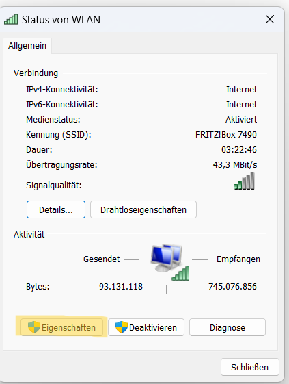

# Python-Kurs

## Material

- Laptop (Windows 10/11)
- Raspberry PI 3
- Jumberkabel und LEDs
- Patchkabel 
- Stromversorgung für Raspi

## Setup

1. VS Code auf dem Laptop installieren: [Download](https://code.visualstudio.com/docs/setup/windows#_install-vs-code-on-windows)
2. Remote Development Erweiterung in VS Code installieren
3. **Windows Netzwerkeinstellungen anpassen** ([Quelle](https://medium.com/@jrcharney/connect-your-raspberry-pi-to-your-computer-via-ethernet-4564e1e68922))
   Unter `Systemsteuerung\Netzwerk und Internet\Netzwerk- und Freigabecenter`
   
   
   
4. **Verbindung zum Microcontroller testen**
   (Der Raspberry PI sollte eingeschaltet sind und mit dem Patchkabel mit dem Laptop verbunden sein)
    1. **Terminal öffnen**
       1. `WIN + R` 
       2. `cmd` Eingeben
        
   
    2. `ping raspi.local`
5. **SSH-Verbindung in VSCode herstellen**
   1. 
   2. 
   3. 
   4. 
   5. (Schritt 1 Wiederholen)
   6. 
   7. (Linux auswählen)
   8. Passwort: 1234 
    
   9. Fertig:    
   10. (Python erweiterung installieren)
   

